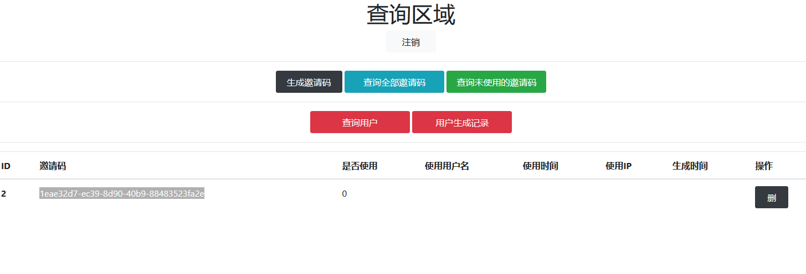
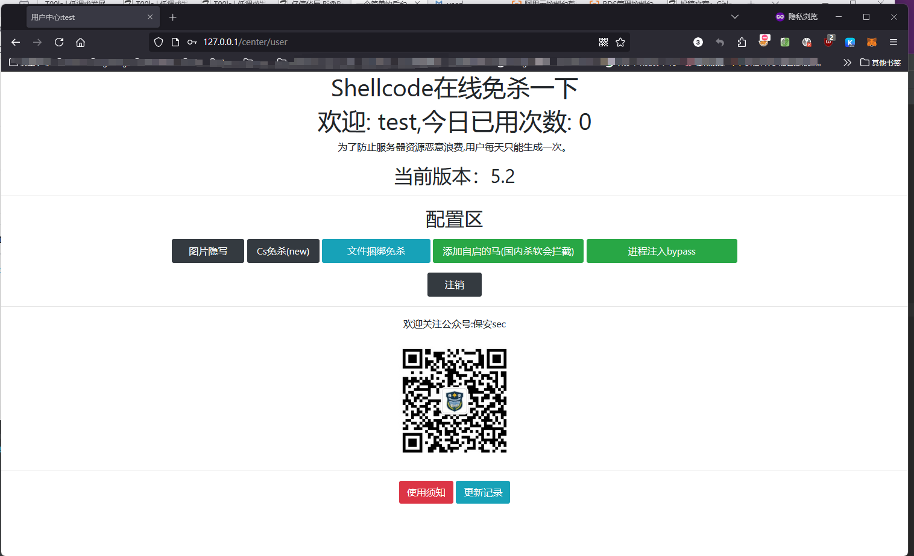

# GoWebShellCode-Bypass

GoWebShellCode-Bypass是一个基于Gin框架开发的在线免杀平台。这个项目最初是在2020年作为一个练手项目开始的，目的是创建一个支持后台管理和邀请码注册的在线免杀平台。

## 功能列表

1. 邀请码注册登录
2. 邀请码生成
3. 简单的后台管理
4. 用户生成记录查询
5. 普通用户每日可生成一次，内测用户可无限生成
6. 延时上线执行
7. hex加密
8. 捆绑马，自启马
9. 图片隐写功能
10. 溯源模式

## 技术要求

- Golang环境
- MySQL数据库

## 安装指南

1. 克隆仓库：
   ```
   git clone https://github.com/CBLabresearch/old-bypass-webBuild.git
   ```

2. 进入项目目录：
   ```
   cd old-bypass-webBuild
   ```

3. 配置数据库连接：
   在`config.go`文件中配置MySQL连接地址、管理员用户名以及设置cookie的站点地址。

4. 运行项目：
   ```
   go run main.go
   ```

## 使用说明

1. 确保MySQL服务已启动。
2. 运行项目后，访问配置的站点地址。
3. 使用邀请码注册新用户。
4. 登录后即可使用平台功能。

## 截图

### 后台管理界面


### 用户前台界面


## 更新日志

```
2020/11/11 增加延时上线执行功能，修复一堆bug
2020/12/14 增加hex加密，恢复免杀，去除一些特征
2020/12/24 后端改用go重写，恢复免杀，去除延时和反虚拟机功能
2020/12/26 增加注册功能
2020/12/27 增加延时上线设置功能
2021/01/25 增加后台管理
2021/01/26 增加捆绑马，自启马
2021/03/10 增加图片隐写功能
2021/03/18 增加溯源模式
```

## 贡献指南

我们欢迎所有形式的贡献，包括但不限于：

- 报告bug
- 提出新功能建议
- 改进文档
- 提交代码修复或新功能

请fork本仓库并创建pull request来提交您的贡献。

## 许可证

本项目采用MIT许可证。详情请见[LICENSE](LICENSE)文件。

## 联系方式

- 博客：[https://www.nctry.com](https://www.nctry.com)
- GitHub：[https://github.com/CBLabresearch](https://github.com/CBLabresearch)

**注意**：本项目仅供学习和研究使用，请勿用于非法用途。作者不对任何滥用或非法使用承担责任。
